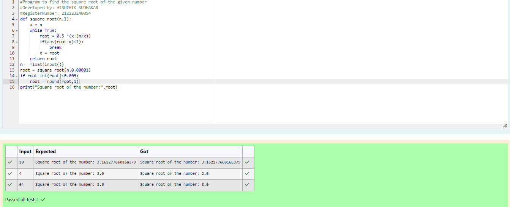

# Find the square root of a number

## AIM:
To write a program to find the square root of a number.

## Equipments Required:
1. Hardware – PCs
2. Anaconda – Python 3.7 Installation / Moodle-Code Runner

## Algorithm
1. Define a function.
2. Assign number_iters = 100 in the function to perform 100 iteratios.
3. Set i = 0.
4. Calculate  number = 0.5 * (number + a / number) for 100 iterations.
5. Return number

## Program:
```python

#Program to find the square root of the given number
#Developed by: HIRUTHIK SUDHAKAR    
#RegisterNumber: 212223240054

def square_root(n,l):
    x = n
    while True:
        root = 0.5 *(x+(n/x))
        if(abs(root-x)<l):
            break
        x = root
    return root
n = float(input())
root = square_root(n,0.00001)
if root-int(root)<0.005:
    root = round(root,1)
print("Square root of the number:",root)
```

## Output:



## Result:
Thus the program to find the square root for the given number(newton's method) using function is written and verified using python programming.
